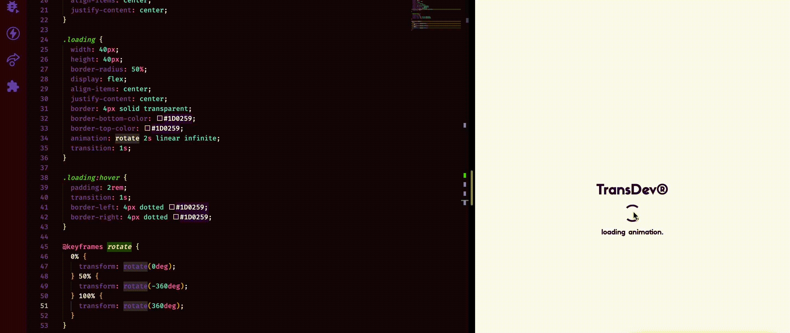

# loading-animation

This project is a simple challenge, using only HTML && CSS, build a loading animation for loading state.

## Stack

- html;
- css;
- vscode;

## Example:

Fork this repo for study and contribution ⭐️ thanks.
